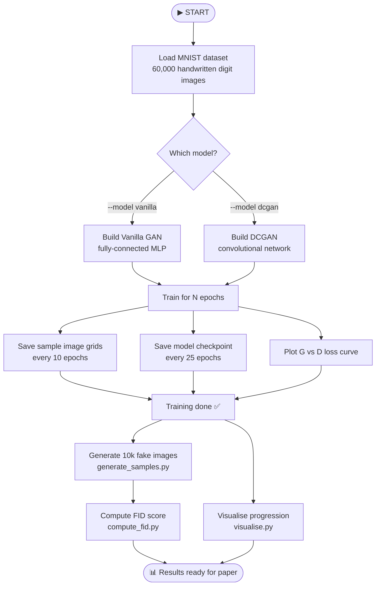
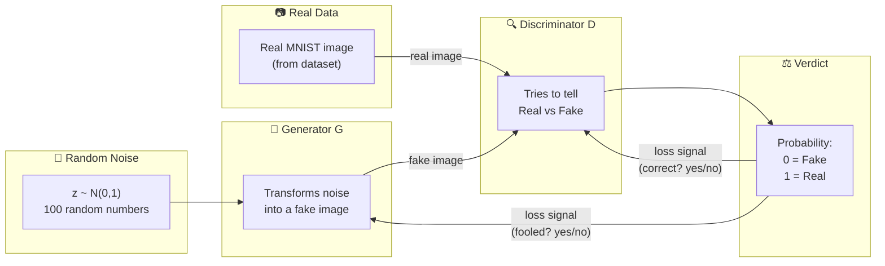
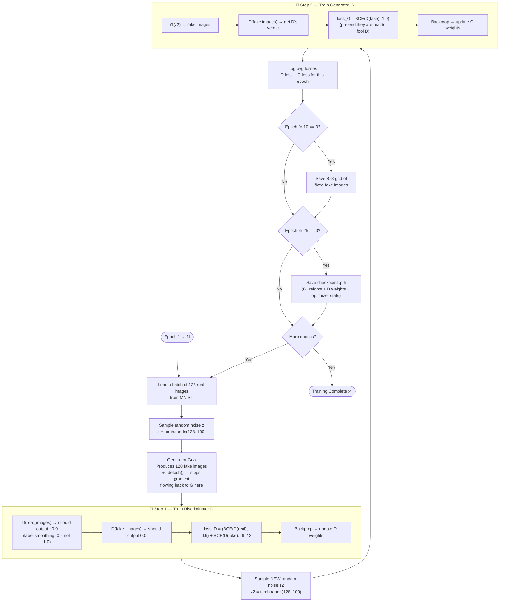
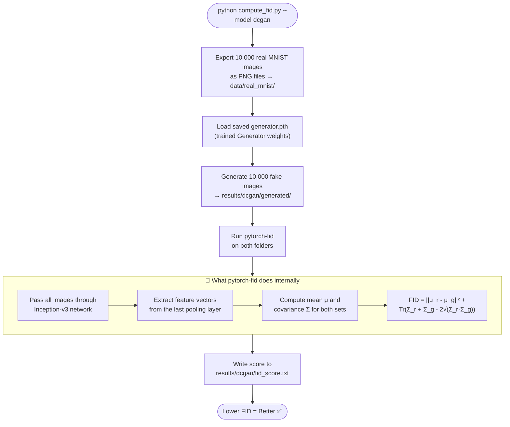
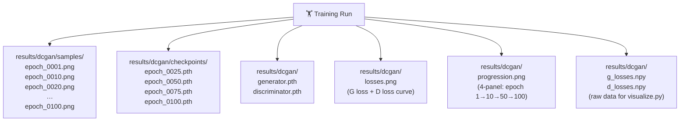

# 🗺️ GAN Pipeline — Complete Flowchart & Deep Explanation

> **How to read this file:** The flowcharts come first (big picture → details),
> then every box in every diagram is explained in plain language below.

---

## 1. The 10,000-Foot View — What the Whole Project Does



---

## 2. What is a GAN? — The Core Idea



> **The Game:** G tries to fool D. D tries not to be fooled.
> They train together — each one getting better because of the other.

---

## 3. The Training Loop — Step by Step



---

## 4. Inside the Vanilla GAN — Architecture

```mermaid
flowchart LR
    subgraph VG ["🔴 Vanilla Generator (MLP)"]
        direction TB
        VG1["Input: z ∈ ℝ¹⁰⁰\n(100 random numbers)"]
        VG2["Linear(100 → 256)\n+ LeakyReLU(0.2)\n+ BatchNorm1d"]
        VG3["Linear(256 → 512)\n+ LeakyReLU(0.2)\n+ BatchNorm1d"]
        VG4["Linear(512 → 1024)\n+ LeakyReLU(0.2)\n+ BatchNorm1d"]
        VG5["Linear(1024 → 784)\n+ Tanh"]
        VG6["Reshape:\n784 → (1, 28, 28) image"]
        VG1 --> VG2 --> VG3 --> VG4 --> VG5 --> VG6
    end

    subgraph VD ["🔵 Vanilla Discriminator (MLP)"]
        direction TB
        VD1["Input: image (1,28,28)\nFlatten → 784"]
        VD2["Linear(784 → 512)\n+ LeakyReLU(0.2)\n+ Dropout(0.3)"]
        VD3["Linear(512 → 256)\n+ LeakyReLU(0.2)\n+ Dropout(0.3)"]
        VD4["Linear(256 → 1)\n+ Sigmoid"]
        VD5["Output: probability\n0.0 = Fake   1.0 = Real"]
        VD1 --> VD2 --> VD3 --> VD4 --> VD5
    end

    VG6 -->|fake image| VD1
```



---

## 5. Inside the DCGAN — Architecture

```mermaid
flowchart LR
    subgraph DCG ["🔴 DC Generator (Convolutional)"]
        direction TB
        DCG1["Input: z ∈ ℝ¹⁰⁰"]
        DCG2["Linear(100 → 6272)\nreshape → (128, 7, 7)"]
        DCG3["BatchNorm2d(128)"]
        DCG4["ConvTranspose2d\n128→64, k=4, s=2, p=1\n📐 7×7 → 14×14\n+ BatchNorm2d + ReLU"]
        DCG5["ConvTranspose2d\n64→1, k=4, s=2, p=1\n📐 14×14 → 28×28\n+ Tanh"]
        DCG1 --> DCG2 --> DCG3 --> DCG4 --> DCG5
    end

    subgraph DCD ["🔵 DC Discriminator (Convolutional)"]
        direction TB
        DCD1["Input: image (1,28,28)"]
        DCD2["Conv2d(1→64, k=4, s=2, p=1)\n📐 28×28 → 14×14\n+ LeakyReLU(0.2)"]
        DCD3["Conv2d(64→128, k=4, s=2, p=1)\n📐 14×14 → 7×7\n+ BatchNorm2d + LeakyReLU(0.2)"]
        DCD4["Flatten → 6272\nLinear(6272 → 1)\n+ Sigmoid"]
        DCD5["Output: probability\n0.0 = Fake   1.0 = Real"]
        DCD1 --> DCD2 --> DCD3 --> DCD4 --> DCD5
    end

    DCG5 -->|fake image| DCD1
```



---

## 6. FID Computation Pipeline



---

## 7. Output Files Map



---

---

# 📖 Deep Explanation — Every Concept Demystified

---

## Part A — What is a GAN?

A **Generative Adversarial Network (GAN)** is a system of two neural networks
locked in a competition. Think of it as a **counterfeiter vs. a detective**:

| Role | Network | Job |
|------|---------|-----|
| Counterfeiter | **Generator (G)** | Makes fake images, tries to fool the detective |
| Detective | **Discriminator (D)** | Examines images, tries to catch fakes |

Neither is told "this is what a digit looks like." They both improve purely through
competition. After enough rounds, G becomes so good that its fakes are
indistinguishable from real images.

---

## Part B — The Loss Functions

Both networks use **Binary Cross-Entropy (BCE)** loss:

```
BCE(output, target) = -[target · log(output) + (1 - target) · log(1 - output)]
```

**Discriminator loss:**
```
loss_D = 0.5 × (BCE(D(real), 0.9) + BCE(D(fake), 0.0))
```
- D should output **~0.9** for real images (label smoothing — see below)
- D should output **~0.0** for fake images

**Generator loss:**
```
loss_G = BCE(D(fake), 1.0)
```
- G pretends its fakes are real (target = 1.0)
- G is rewarded when D outputs high probability for fake images
- If D outputs 0.01 for a fake image → G gets big loss → updates weights strongly

> 📌 **Key insight:** G never sees real images directly. It only receives
> a gradient signal from D saying "how convincing was your fake?"

---

## Part C — Label Smoothing

Instead of using real labels = **1.0**, we use **0.9**.

**Why?**
If D becomes too confident (D(real) → 1.0 with near-zero gradient), it stops
learning and gives G zero signal to improve. Using 0.9 keeps D slightly
uncertain, ensuring gradients keep flowing.

Fake labels stay at **0.0** — we want D to be confident fakes are fake.

---

## Part D — `.detach()` — Why We Use It

```python
fake_imgs = G(z).detach()   # ← when training D
```

When training D, we feed it G's output. But if we backprop through D's loss,
PyTorch would **also update G's weights** by mistake (because D(G(z)) forms a
computation graph through G).

`.detach()` cuts the graph at G's output — D's loss only updates D's weights,
not G's.

When training G:
```python
gen_imgs = G(z)             # ← NO .detach()
loss_G = BCE(D(gen_imgs), 1.0)
loss_G.backward()           # gradient flows through D AND back into G
```
Here we want the gradient to flow all the way back into G.

---

## Part E — Vanilla GAN vs DCGAN

### Vanilla GAN (MLP)

- Uses only **fully connected layers** (`nn.Linear`)
- The image is treated as a flat **784-dimensional vector** (28×28 = 784)
- Has no spatial awareness — doesn't know pixels next to each other are related
- Tends to produce **blurrier** images
- Faster to train on CPU

### DCGAN (Convolutional)

- Uses **transposed convolutions** in G (upsampling) and **strided convolutions** in D
- Processes images as **2D grids** — understands spatial structure
- ConvTranspose2d doubles the spatial size (7×7 → 14×14 → 28×28)
- Conv2d halves the spatial size (28×28 → 14×14 → 7×7)
- Produces **sharper, more realistic** images
- Slower on CPU (about 15× per epoch vs Vanilla), but that's the price of quality

### Key Design Rules from the DCGAN Paper (Radford 2015)

| Rule | Why |
|------|-----|
| No pooling layers — use strided conv | Pooling loses spatial info; strided conv learns downsampling |
| BatchNorm in both G and D | Stabilises training, prevents mode collapse |
| ReLU in G, except the output layer uses Tanh | Tanh maps to [-1, 1] matching normalised MNIST |
| LeakyReLU in D (slope=0.2) | Regular ReLU can die; LeakyReLU keeps gradient flowing for negative inputs |
| Adam(β₁=0.5) | Lower momentum than default (0.9) prevents oscillation in GAN training |

---

## Part F — Weight Initialisation

```python
def weights_init(m):
    if "Conv" in classname or "Linear" in classname:
        nn.init.normal_(m.weight.data, 0.0, 0.02)
    elif "BatchNorm" in classname:
        nn.init.normal_(m.weight.data, 1.0, 0.02)
        nn.init.constant_(m.bias.data, 0)
```

PyTorch's default initialisation doesn't work well for GANs. The DCGAN paper
found that **N(0, 0.02)** (small values centred at zero) gives better training
stability. BatchNorm weights start at **N(1, 0.02)** because BN multiplies by
its weight — starting near 1 makes BN nearly an identity at startup.

---

## Part G — YAML Config System

Instead of hardcoding hyperparameters, they live in `configs/dcgan.yaml`:

```yaml
lr: 0.0002
batch_size: 128
epochs: 100
label_smoothing: 0.9
```

You can run experiments with different settings without touching the code:
```bash
# Fast experiment
python gan_mnist.py --config configs/dcgan.yaml --epochs 50

# Custom batch size
python gan_mnist.py --model dcgan --batch_size 64 --epochs 100
```

CLI flags override YAML values, so you can have a base config and tweak
individual parameters from the command line.

---

## Part H — Fixed Noise for Consistent Samples

```python
fixed_z = torch.randn(64, LATENT_DIM, device=device)
```

This is created **once before training** and never changed. Every 10 epochs
we generate images from this same noise. This lets you see the **same 64
"seeds" improve over time** — you directly observe the generator learning.

Without fixed noise, each epoch shows different seeds, making it hard to
track improvement.

---

## Part I — Checkpointing

```python
ckpt = {
    "epoch":   epoch,
    "G_state": G.state_dict(),
    "D_state": D.state_dict(),
    "opt_G":   opt_G.state_dict(),
    "opt_D":   opt_D.state_dict(),
    "cfg":     cfg,
}
torch.save(ckpt, ckpt_path)
```

A checkpoint saves **everything** needed to resume training:
- Model weights (`state_dict`)
- Optimiser states (Adam's momentum buffers — critical for resuming properly)
- The config (so you know what settings were used)

Without saving the optimiser state, resuming would restart Adam's momentum
from scratch, causing a "jerk" in the loss curve.

---

## Part J — FID Score Explained

**Fréchet Inception Distance** measures how similar the distribution of fake
images is to real images.

**Step 1:** Feed both real and fake images through a pretrained Inception-v3
network (trained on ImageNet). Extract the 2048-dim features from the last
pooling layer.

**Step 2:** Compute the mean (μ) and covariance matrix (Σ) of those features
for real images, and separately for fake images.

**Step 3:**
```
FID = ||μ_real - μ_fake||²  +  Tr(Σ_real + Σ_fake - 2√(Σ_real · Σ_fake))
```

- **Lower FID = better** (fake distribution closer to real distribution)
- FID = 0 means perfect match (impossible in practice)
- DCGAN on MNIST: typically **15–35** (good)
- Vanilla GAN on MNIST: typically **60–90** (decent but blurrier)

> ⚠️ **Limitation:** Inception-v3 was trained on colour ImageNet images.
> MNIST is grey-scale and very different. FID on MNIST is not perfectly 
> calibrated, but still useful for comparing Vanilla vs DCGAN.

---

## Part K — What the Loss Curves Tell You

```
D loss ~= 0.5–0.7  →  Healthy training (D is uncertain)
D loss ~= 0.0      →  Discriminator won, G gets no gradient (training collapsed)
D loss ~= 1.0      →  Generator is dominating, D can't learn
G loss decreasing  →  Generator improving
G loss exploding   →  Generator failing, needs more training or lower LR
```

Ideal behaviour: both losses hover in the 0.5–1.5 range and slowly converge.
Perfect equilibrium theory: D loss = log(2) ≈ 0.693.

---

## Part L — The Full Command Sequence

```bash
# 0. Activate environment
source venv/bin/activate

# 1. Train Vanilla GAN (100 epochs, ~8 min CPU)
python gan_mnist.py --config configs/vanilla.yaml

# 2. Train DCGAN (100 epochs, ~2.5 hrs CPU  OR  ~5 min GPU)
python gan_mnist.py --config configs/dcgan.yaml

# 3. Generate 10k images for FID (each model)
python generate_samples.py --model vanilla --n 10000
python generate_samples.py --model dcgan   --n 10000

# 4. Compute FID scores
python compute_fid.py --model vanilla
python compute_fid.py --model dcgan

# 5. Visualise results
python visualize.py --model vanilla            # loss curve + progression
python visualize.py --model dcgan              # loss curve + progression
python visualize.py --compare                  # side-by-side comparison
```

After step 5, all figures needed for the paper are in `results/`.

---

*CS318 – GAN-Based Image Generation | Faqre Alam (23/CS/150) · Ekansh Agrawal (23/CS/149)*
