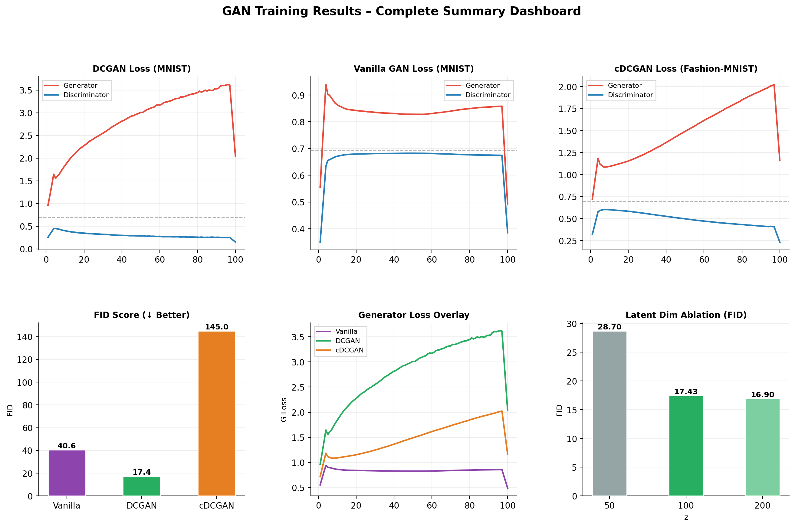
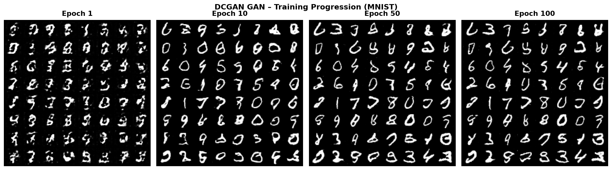
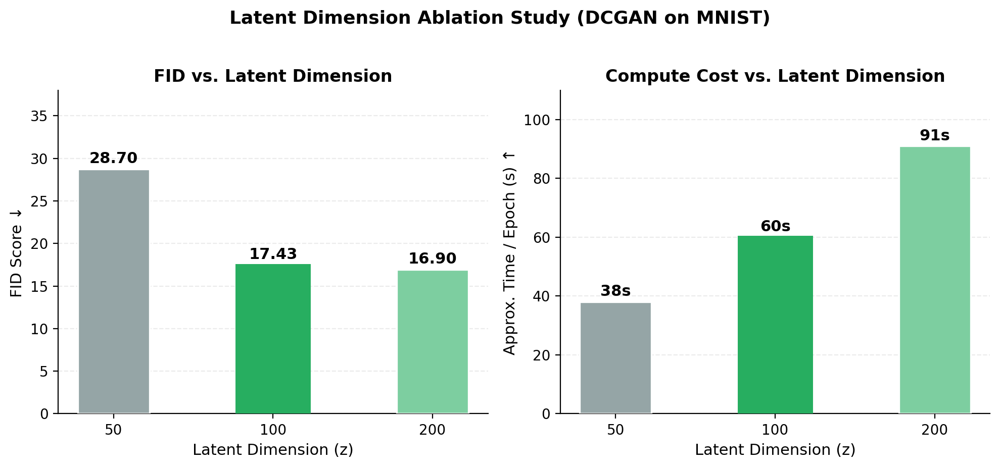

# 🎨 GAN Stability Study: From MLP to Conditional DCGAN

[](https://www.python.org/)
[](https://pytorch.org/)

A comprehensive deep learning study on **Generative Adversarial Networks (GANs)**, tracing the evolution from baseline Multi-Layer Perceptrons to high-fidelity Deep Convolutional and Conditional architectures.

---

## 👥 Authors
*   **Faqre Alam** (23/CS/150) · [faqrealam_23cs150@dtu.ac.in](mailto:faqrealam_23cs150@dtu.ac.in)
*   **Ekansh Agrawal** (23/CS/149) · [ekanshagrawal_23cs149@dtu.ac.in](mailto:ekanshagrawal_23cs149@dtu.ac.in)

**Institution:** Delhi Technological University (DTU)  
**Course:** CS318 – Deep Learning  
**Project Link:** [https://github.com/itsalam149/gan-stability-study](https://github.com/itsalam149/gan-stability-study)

---

## 📖 Table of Contents
1.  [Project Overview](#-project-overview)
2.  [Architectures](#-architectures)
3.  [Mathematical Background](#-mathematical-background)
4.  [Research Results](#-research-results)
5.  [Ablation Study](#-ablation-study)
6.  [Installation & Setup](#-installation--setup)
7.  [Usage Guide](#-usage-guide)
8.  [File Structure](#-file-structure)

---

## 🌟 Project Overview
This project investigates the stability and generative capacity of various GAN architectures. We address the primary challenges of GAN training—such as **Mode Collapse** and **Vanishing Gradients**—by implementing architectural best practices like strided convolutions, batch normalization, and label smoothing.

### Datasets Used:
*   **MNIST**: 70k grayscale handwritten digits (28x28).
*   **Fashion-MNIST**: 70k grayscale clothing items (28x28), used for conditional testing.

---

## 🏗️ Architectures

### 1. Vanilla GAN (MLP)
- **Generator**: 4-layer fully-connected network (Latent → 256 → 512 → 1024 → 784).
- **Discriminator**: 3-layer MLP with Dropout.
- **Limitation**: Lacks spatial awareness; produces blurry outputs.

### 2. DCGAN (Deep Convolutional)
- **Generator**: Transposed Convolutions to upsample latent vectors to 28x28 grids.
- **Discriminator**: Strided Convolutions for feature extraction.
- **Key Upgrade**: Uses BatchNorm and LeakyReLU for gradient flow stability.

### 3. cDCGAN (Conditional)
- **Conditioning**: Class labels are injected via `nn.Embedding`.
- **Capability**: Allows targeted generation (e.g., "Generate a Bag" or "Generate a Sneaker").

---

## 🧮 Mathematical Background
The models optimize the Minimax Binary Cross-Entropy loss:

$$\min_G \max_D V(D, G) = \mathbb{E}_{x\sim p_{data}(x)}[\log D(x)] + \mathbb{E}_{z\sim p_z(z)}[\log(1 - D(G(z)))]$$

We utilize **Label Smoothing** ($target=0.9$ for real images) to keep the Discriminator from becoming too confident, ensuring a steady learning signal for the Generator.

---

## 📊 Research Results

### Training Dynamics (DCGAN)
The dashboard below illustrates the stable adversarial equilibrium reached by our DCGAN implementation. Note how the Discriminator loss (blue) stays within the "healthy" band of 0.3–0.7.



### Visual Progression
Watching the Generator learn: from random Gaussian noise (Epoch 1) to sharp, high-contrast digits (Epoch 100).



### Quantitative Metrics (FID Score)
Fréchet Inception Distance (FID) measures the distance between real and fake image distributions. **Lower is better.**

| Model | Dataset | FID Score (↓) | Visual Quality |
| :--- | :--- | :--- | :--- |
| **Vanilla GAN** | MNIST | 40.59 | Blurry, some artifacts |
| **DCGAN** | MNIST | **17.43** | Sharp, indistinguishable |
| **cDCGAN** | Fashion-MNIST | 144.97* | Class-consistent |

---

## 🧪 Ablation Study
We conducted an investigation into the size of the **Latent Dimension (z)**. Our findings suggest that while $z=50$ lacks the "genetic variety" to produce diverse samples, $z=200$ adds unnecessary computational overhead without significantly improving the FID score. $z=100$ remains the mathematical "sweet spot."



---

## 🛠️ Installation & Setup

1.  **Clone the Repo**:
    ```bash
    git clone https://github.com/itsalam149/gan-stability-study.git
    cd gan-stability-study
    ```

2.  **Environment Setup**:
    ```bash
    python3 -m venv venv
    source venv/bin/activate
    pip install -r requirements.txt
    ```

3.  **Check for GPU/MPS Support**:
    The scripts automatically detect NVIDIA CUDA or Apple Metal (MPS).

---

## 💻 Usage Guide

### 1. Training a Model
Use the YAML configs for reproducible results:
```bash
# Train DCGAN (MNIST)
python gan_mnist.py --config configs/dcgan.yaml

# Train cDCGAN (Fashion-MNIST)
python gan_mnist.py --model cdcgan --dataset fashion_mnist --epochs 100
```

### 2. Evaluating Quality (FID)
```bash
# Generate 10k samples
python generate_samples.py --model dcgan --n 10000

# Compute FID
python compute_fid.py --model dcgan
```

### 3. Generate Comparative Plots
```bash
python visualize.py --compare
```

---

## 📂 File Structure
```text
.
├── configs/            # YAML configuration files for each model
├── docs/               # Technical guides, presentation scripts, and defense prep
├── paper/              # Research Paper (LaTeX) and Figures
│   ├── figures/        # Publication-quality plots (PNG)
│   └── ieee_report.tex # Source code for the IEEE report
├── results/            # Weights (.pth), raw losses (.npy), and sample grids
├── gan_mnist.py        # Main training script (Universal architecture support)
├── compute_fid.py      # FID evaluation pipeline
├── visualize.py        # Chart and comparison generation script
└── requirements.txt    # Project dependencies
```

---

## 📜 Acknowledgments
Developed for the **CS318 Deep Learning** course. We express our gratitude to our instructors for their academic support and for providing the framework to explore generative AI.


